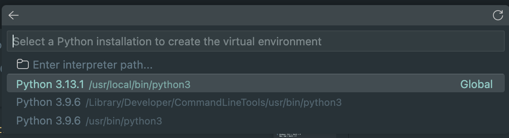
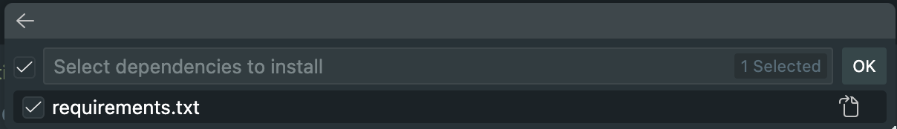
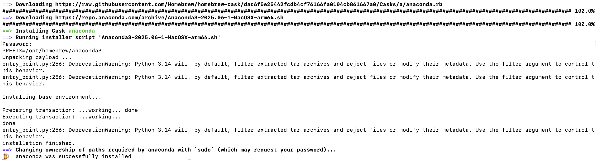
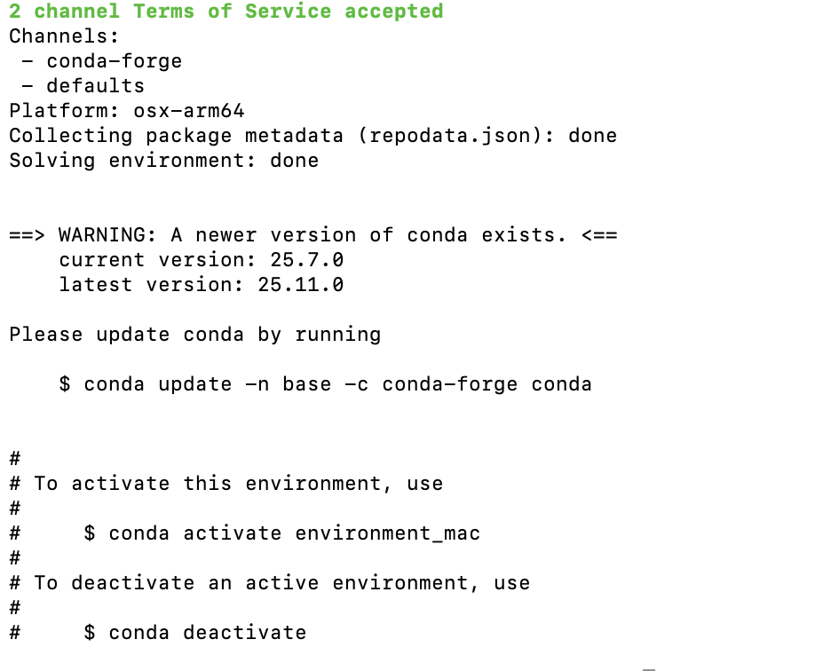
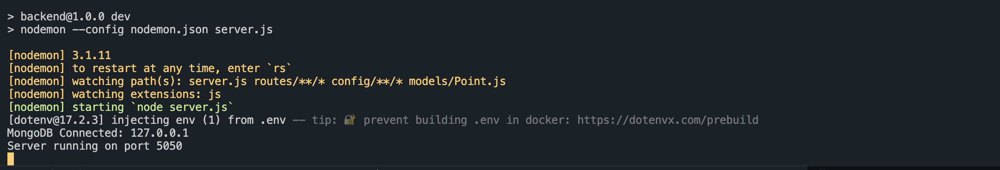
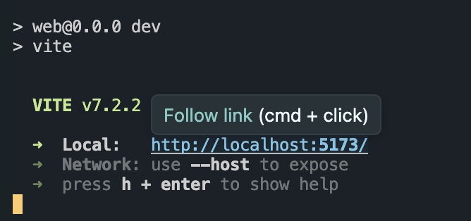
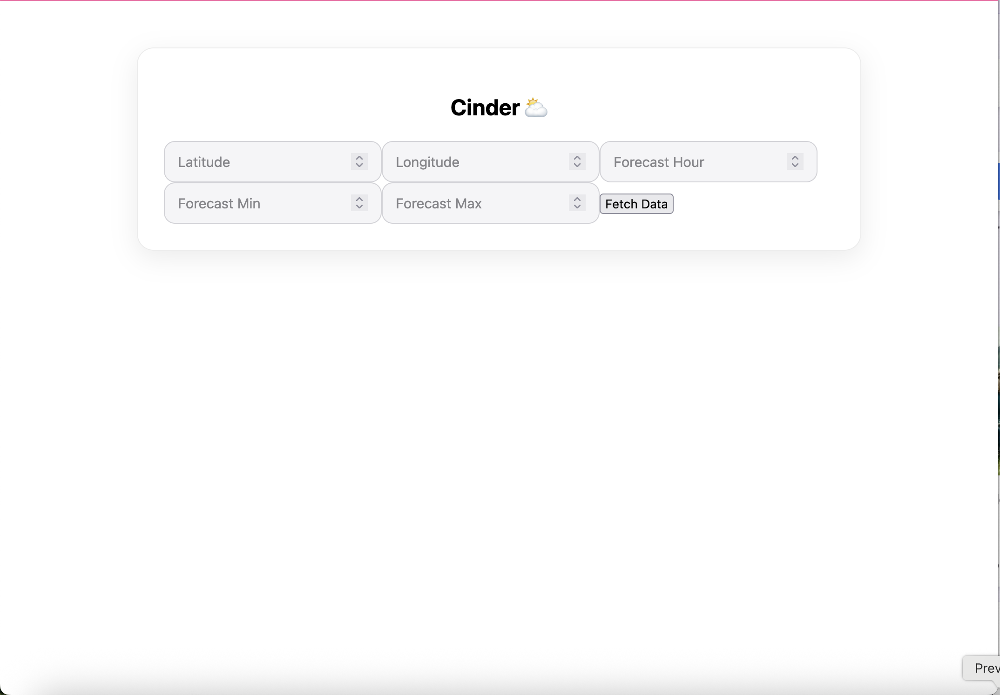
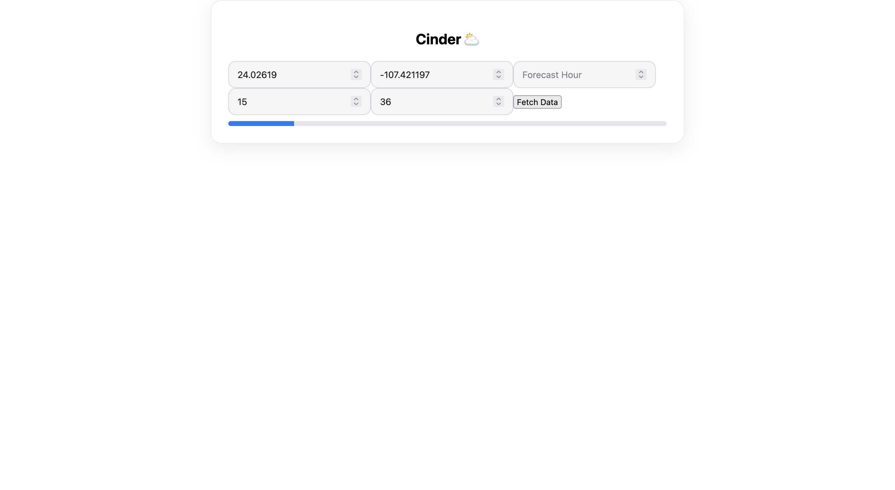
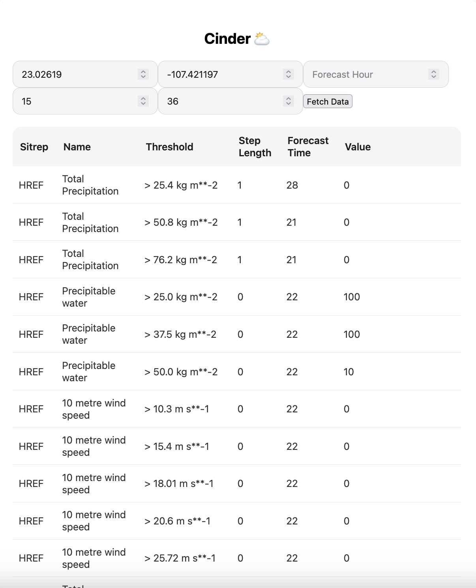

# Cinder
Project for COMP333  

# Table Of Contents
- [Members](#members)
- [System Requirements](#system-requirements)
- [Start Up](#start-up)
    - [Create An Enviroment](#create-a-python-enviroment)
    - [Necessary Imports](#imports)
    - [Run Local Website](#starting-local-website)
- [How To Use](#how-to-fetch-data)
    - [More Info On Functions](#documentation)
- [How Do You Know It Works](#how-do-you-know-it-works-unit-tests)
- [StyleGuide](#style-guide)
    - [Branching](#branching)
- [How To Use](#how-to-interrupt-data-fetch--end)
- [Cycle Downloading](#cycle-downloading)
- [Documentation](#documentation)
- [Issues Tracker](#issues)

## Members
Hawklight1: Ben Mckinney  
bentaffet: Ben Taffet  
Chvoong24: Chris Voong  
duyhuynh-dev: Duy Huynh    

## System Requirements
Have at least **15GB** of free storage
Must use Conda environment on Windows (Pygrib package does not work with pip)
0. Preferably use Conda on Mac as well to avoid issues. 

## Start Up
1. Clone Repository 
> Instructions For VSCode IDE
#### Create A Python Enviroment on mac
1. Windows: Ctrl + Shift + P  
   Mac: Cmd + Shift + P  

0. Select: ``Python: Create Enviroment...``
0. Select: ``Venv``
-   For **.venv** only
1. Select: ``Python 3.13.x``
</img>
0. Select: requirements.txt
</img>
0. Open a new Terminal Window
0. Terminal Line should say ``(.venv) (base)...``

### Create a conda environment on Mac
1. Install brew if you do not have it
1. Download conda by running ```brew install --cask anaconda``` in your terminal. You should see the following messages after typing your password.
</img>
1. Check conda is installed by typing ```conda --version```
1. Enter ```conda env create -f environment_mac.yml``` into your terminal. Ensure you are in the "Cinder" main folder.
</img>
1. Follow instructions given in terminal to activate the environment. It should be ```conda activate environment_mac``` as seen above.

## Import Required Python Libraries (OPTIONAL)
1. Ensure you are in the main "Cinder" directory.
2. In the terminal, run the command ``pip install -r requirements.txt``

## Starting Local Website 
1. [Download MongoDB Community](https://www.mongodb.com/docs/manual/administration/install-community/?operating-system=macos&macos-installation-method=homebrew)
    - Choose your OS and follow download instructions and install
    - Run MONGODB as a background process ```mongod --config /opt/homebrew/etc/mongod.conf --fork```
        - Remove  ```--fork``` if it does not work

0. In your terminal, change directory until you are in the backend directory
    - ```.../where/your/file/is/backend```
    1. ```terminal 
        cd .../Cinder/cinder-app/backend
        ```
    0. Type ```npm install nodemon --save-dev``` in your terminal
    0. run ```npm run dev``` in your terminal  
    ### **Output**
    </img>

0. In a **new** terminal, change directory until you are in frontend/cinderWeb
    - ```.../where/your/file/is/frontend/cinderWeb```
    1. ```terminal
       cd .../Cinder/cinder-app/frontend/cinderWeb
       ```
    0. run ```npm install vite --save-dev```
    0. run ```npm run dev``` in your terminal
    ### **Output**
    </img>
0. Go to localhost that was printed in frontend terminal on a browser


## Navigating The Website
- Once all the steps above are completed navigate to [localhost](http://localhost:5173])
- Browser should look like this:  
<!--  -->
</img>
>Note: You must have run the fetch_all.py script located at ```../Cinder/fetch_all.py``` for the web interface to properally fetch data. For more info, go to [How To Fetch Data](#how-to-fetch-data).
- Input your latitude and longitude in their respective search boxes, once populated, click the ``Fetch Data`` button
- For example, lat: 24.02619 lon: -107.421197
    -   **Optional**  
        You are able to input your forecast hour or range as well, though not required. The output will just be the entire JSON file. For this example, I will use the ranges from 15-36 inclusive. 

 </img>
- The blue loading bar indicates the fetching progress
>Note: It may take up to 10 minutes to finish fetching all data. 

**Finished Output**  
</img>

- The output is sorted by weather model alphabetical order: HREF, NBM, RRFS

## How To Fetch Data
1. Go to the **fetch_all.py** file
0. Run file
0. Files appear in ```<model>_data```. In ```<model>_data``` download files appear in ```<model>_download``` folder. Logs appear in ```<model>_log``` folder.
0. Wait for completion checks in IDE terminal (may take a while)

>Note: You can interrupt the fetch data process whenever you feel like it after you run the file

## How To Interrupt Data Fetch
1. In the terminal window, press ```Ctrl``` + ``` C ``` until terminal stops printing

## How Do You Know It Works? (Unit Tests)
1. Run ```fetch_all.py```
0. Go into repository directory
0. *If* ```<model>_data``` exists and contains ```<model>_download``` and ```<model>_logs```, it passes unit test
0. *If not*, it has failed

## How to Visualize downloaded data
> This section is subject to change as we continue to improve and automate data collection and visualization.
1. Move the folder with the sitrep downloads into the grib_to_json folder. The folder will be called ```<model_download>``` as above. See visualization below for where to put the folder.  
&nbsp;a. You can do this by dragging files in your system directory or if you have the project open in VSCode.
```text
    /Cinder
    ├── Fetch_Scripts
    └── grib_to_json
         └── <sitrep>_download
```
2. In your terminal, run ```python grib_data_to_json.py```  
&nbsp;a. The script requires 3 arguments: a latitude, longitude and sitrep, in this order.  
&nbsp; To run the script correctly, use the following format: ```grib_data_to_json.py <lat> <lon> <sitrep>```.  
&nbsp;b. An example input for testing purposes could be ```grib_data_to_json.py 24.02619 -107.421197 href```. The only sitreps for now are "href", "nbm" and "refs".  
3. You should see a json file that appears in the ```grib_to_json``` folder.
4. In your terminal, run ```python forecast_json_parser.py```.  
&nbsp;a. The script requires 2 arguments: the name of the json file and a forecast hour from 0 to 48.  
&nbsp; To run the script correctly, use the following format: ```forecast_json_parser.py <json_filename> <forecast_hour>```.  
&nbsp; An example input for testing purposes could be ```forecast_json_parser.py href12z_for_24.02619,-107.421197.json 8```.  
5. You should see a printout with metadata and lines of probabalistic forecasts similar to the following:
```text
    Model: href
    Forecast time: 2025-10-16 12:00:00
    Location: {'lat': 24.02619, 'lon': -107.421197}
    Probability of > 12.7 kg m**-2 of Total Precipitation between 2025-10-16 19:00:00 and 2025-10-16 20:00:00 is 0.0
     ·
     ·
     ·
```
6. For now, there is a folder in grib_to_json called ```href_downloads``` which includes a sample href cycle download.  
There are also two sample json files that you can use to test ```forecast_json_parser.py```.

## Cycle Downloading
This is the setup for downloading the sitreps every 6 hours.
> This only works for mac   
- Get path to fetch_all.py
  - Open your a terminal window
  - Locate fetch_all.py in the main Cinder folder.
  - Drag the file from Finder and drop it directly into the Terminal window.
  - The full path to the file will automatically be inserted at the cursor's current position.
- Copy the script below and paste it into your terminal: ```SCRIPT_PATH="/path/to/your_script.py"
PYTHON_PATH=$(which python3) 
CRON_JOB="0 */6 * * * $PYTHON_PATH $SCRIPT_PATH" 
( crontab -l 2>/dev/null | grep -Fv "$SCRIPT_PATH" ; echo "$CRON_JOB" ) | crontab -```

- Replace ```"/path/to/your_script.py"``` with the path you got for fetch_all.py
- Click "Enter/Return"
- Type ```crontab -l``` into your termninal to check if it is there.
- type ```crontab -r``` to remove the cron.

## Documentation
Documentation for all functions can be found at ```build/html/index.html```. It is still work in progress.  

## Issues
A list of current issues and the state of the project can be found on our [Trello Board](https://trello.com/invite/b/68e3da706221ff22901d141c/ATTI9234f181668ee06c796b682eeee9fb732B0B90BF/team-cinder).

